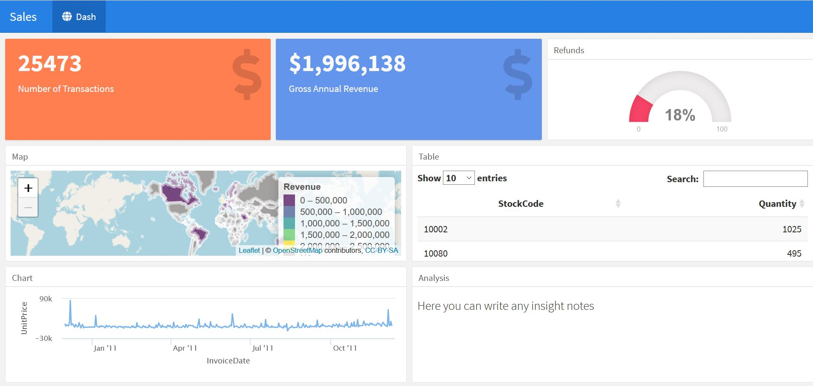

## Summary Description

This repository contains code for development of interactive dashboard tracking sales performance. The data used is the notorious data set from the UK retailer, you ca find it [here](https://www.kaggle.com/carrie1/ecommerce-data). 
The dashboard was built in shiny. You can find more info about the app [here](https://shiny.rstudio.com/)
The output of the code is hosted for the moment [here]( https://dg0485.shinyapps.io/Sales_Shiny_Dashboard/). However, this is temporary. As the data set is quite large it might take a while to load. 

## Objective

This repository was developed to serve as a template for building a basic interactive dashboard summarising sales performance. The initial idea was to create a dashboard that provides you with the code of some cool shiny features that you can include I your own reporting. You can always change the KPI metrics you track and the time dimensions. You can also move around and play with the sizes of the different elements of the dashboard according to the UX you want to create and the story you want to tell. 

## Disclaimer 

Very unwisely I built the dashboard using a data set with a significant size. This makes the rendering of the code quite slow.

## Repository Content

The main file of the repository is the code of the shiny app and you can find it [here](./Sales_Shiny_Dashboard.Rmd)
